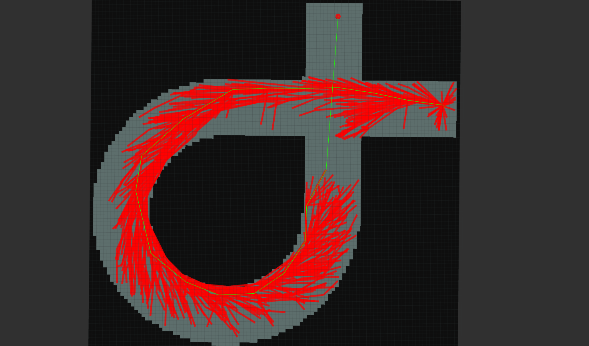

# **University project of RRT * algorithm for car path planning**

> Goal: The algorithm must find the path on the map taking into account the kinematics of the car.
<p>
</p>

---

### Important
- Preconfigured Rviz is required for proper operation.
---
## How To Use


- **To run clean RRT\*:**
```
    roslaunch rrt_star_car_path rrt_star.launch
```
 - **To run rrt\* + car model:**
```
    roslaunch rrt_star_car_path rrt_star_car.launch
```